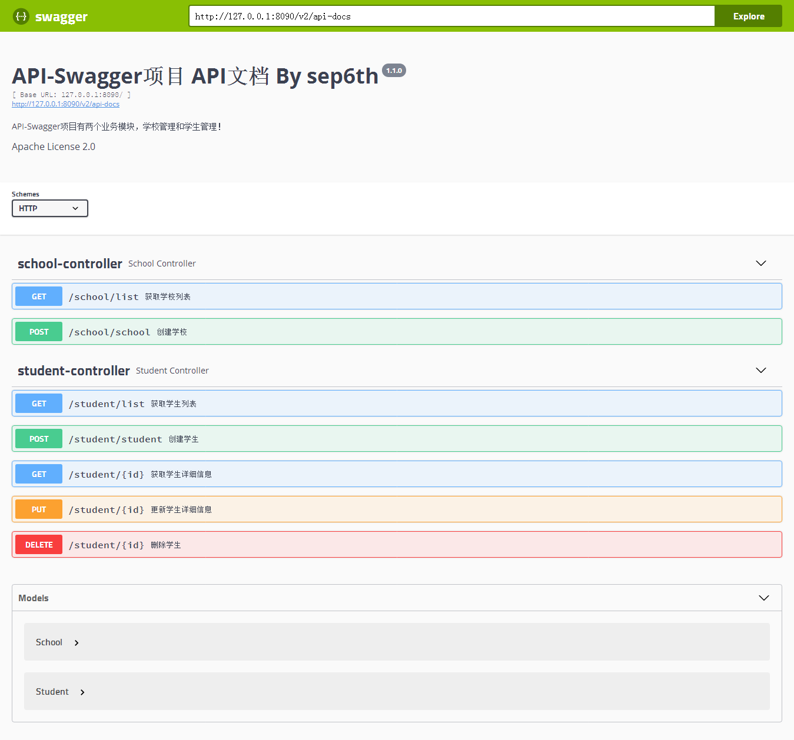

# api-swagger

启动Tomcat，访问：http：//localhost:8090

**效果图**



**实现步骤**

1.添加Maven依赖

```xml
<dependency>
        <groupId>io.springfox</groupId>
        <artifactId>springfox-swagger2</artifactId>
        <version>2.8.0</version>
</dependency>
<dependency>
        <groupId>io.springfox</groupId>
        <artifactId>springfox-swagger-ui</artifactId>
        <version>2.8.0</version>
</dependency>
```

2.下载[swagger-ui](https://github.com/swagger-api/swagger-ui)  
解压zip -&gt; 复制dist文件 -&gt; 重命名swagger-ui -&gt; 放到webapp/static/plug目录下

3.自定义SwaggerConfig类

```java
/** 
 * The Apache License 2.0
 * Copyright (c) 2018 sep6th
 * @see http://springfox.github.io/springfox/docs/current/#configuring-springfox
 */
@EnableSwagger2
@Configuration
public class SwaggerConfig{
    @Bean
    public Docket createRestApi() {
            return new Docket(DocumentationType.SWAGGER_2)
                    .apiInfo(apiInfo())
                    .produces(newHashSet(MediaType.APPLICATION_JSON_VALUE))
                    .protocols(Sets.newHashSet("http"/* , "https" */))
                    .forCodeGeneration(true)
                    .select()
                    .apis(RequestHandlerSelectors.any()) // 扫描所有路径下的api文档
                    .paths(paths()) // 筛选路径，生成API文档
                    .build();
    }
    /**
     * api基本信息
     */
    private ApiInfo apiInfo() {
            return new ApiInfoBuilder()
                    .title("API-Swagger项目 API文档 By sep6th")    // 标题
                    .description("API-Swagger项目有两个业务模块，学校管理和学生管理！")    // 描述
                    .license("Apache License 2.0")
                    .version("1.1.0")    // api 版本号
                    .build();
    }

    /**
     * 筛选路径
     */
    private Predicate<String> paths() {
            return Predicates.or(
                    PathSelectors.regex("/student.*"),
                    PathSelectors.regex("/school.*"));
      }
}
```

4.MVC配置

```xml
    <!-- 配置扫描器, 使得@Controller注解生效 -->
    <context:component-scan base-package="com.sep6th.*.controller">
        <!-- 用swagger页面操作api时,不配置报406 -->
        <context:include-filter type="annotation" expression="org.springframework.stereotype.Controller"/>
    </context:component-scan>
    <!-- 配置扫描器, 生成swagger-Api页面 -->
    <context:component-scan base-package="springfox.documentation.swagger2"/>
    <!-- 配置扫描器, 必须在MVC配置文件里，扫描自定义swagger配置 -->
    <context:component-scan base-package="com.sep6th.base.config"/>

    <mvc:annotation-driven />

    <!-- 处理静态资源被“/”所拦截的问题 -->
    <mvc:default-servlet-handler />

    <bean class="org.springframework.web.servlet.view.InternalResourceViewResolver">
        <property name="prefix" value="/WEB-INF/view/"/>
        <property name="suffix" value=".jsp"/>
    </bean>
```

5.jsp页面

```jsp
<%@ page language="java" contentType="text/html; charset=UTF-8"
    pageEncoding="UTF-8"%>
<!DOCTYPE html PUBLIC "-//W3C//DTD HTML 4.01 Transitional//EN" "http://www.w3.org/TR/html4/loose.dtd">
<html>
<head>
<meta http-equiv="Content-Type" content="text/html; charset=UTF-8">
<title>API DOCS</title>
<link href="https://fonts.googleapis.com/css?family=Open+Sans:400,700|Source+Code+Pro:300,600|Titillium+Web:400,600,700" rel="stylesheet">
<link rel="stylesheet" type="text/css" href="static/plug/swagger-ui/swagger-ui.css" >
<link rel="icon" type="image/png" href="static/plug/swagger-ui/favicon-32x32.png" />
<link rel="icon" type="image/png" href="static/plug/swagger-ui/favicon-16x16.png" />
<style>
html {
  box-sizing: border-box;
  overflow: -moz-scrollbars-vertical;
  overflow-y: scroll;
}
*, *:before, *:after {
  box-sizing: inherit;
}
body {
  margin:0;
  background: #fafafa;
}
</style>
</head>
<body>
    <div id="swagger-ui"></div>
</body>
<script src="static/plug/swagger-ui/swagger-ui-bundle.js"> </script>
<script src="static/plug/swagger-ui/swagger-ui-standalone-preset.js"> </script>
<script>
window.onload = function(){
    const ui = SwaggerUIBundle({
    url: "http://127.0.0.1:8090/v2/api-docs",
    dom_id: '#swagger-ui',
    deepLinking: true,
    presets: [
      SwaggerUIBundle.presets.apis,
      SwaggerUIStandalonePreset
    ],
    plugins: [
      SwaggerUIBundle.plugins.DownloadUrl
    ],
    layout: "StandaloneLayout"
  })
  window.ui = ui;
}
</script>
</html>
```

6.Controller

```java
@Controller
public class ApiController {

    /**
     * 显示API 文档
     */
    @RequestMapping("/api")
    public String api(){
        return "api-docs";
    }

}
```


